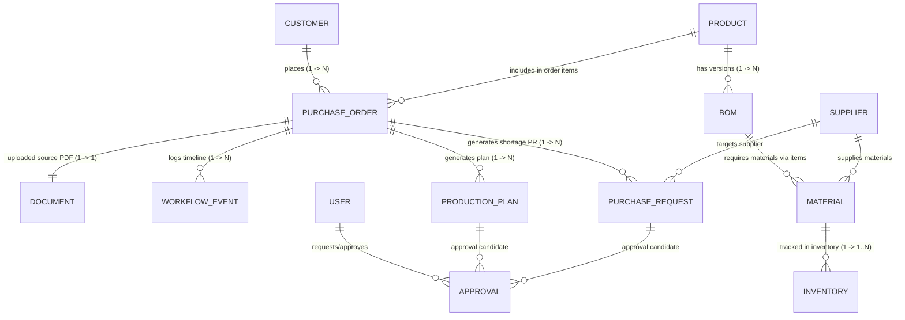
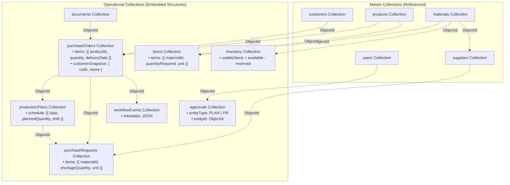

# Database Design Specification: AI-Powered Manufacturing Operations Copilot

**Domain**: Automotive Brake-Pad Manufacturing Operations  
**Architecture**: Document-Oriented Database Layer using MongoDB & Mongoose  
**Target Environment**: Node.js microservices / Express API compatible  

---

## 1. Project Purpose & Business Context

In automotive brake-pad manufacturing, operational efficiency depends on seamless synchronization between customer purchase orders, Bill of Materials (BOM) explosions, live raw material stock audits, shortage detection, shop-floor production scheduling, and procurement workflows.

This database layer models the complete end-to-end manufacturing workflow:
```
Customer Purchase Order 
  ➜ Purchase Order Data Extraction & Validation 
  ➜ Product & Active BOM Resolution 
  ➜ Material Requirements Calculation 
  ➜ Usable Inventory Check (Available - Reserved Stock) 
  ➜ Material Shortage Detection 
  ➜ AI Shop-Floor Production Planning (Daily Shifts & Capacity Allocation) 
  ➜ Purchase Request Generation for Material Shortages 
  ➜ Executive Manager Approval 
  ➜ Production Schedule Dispatch
```

---

## 2. MongoDB Architecture & Design Strategy

Unlike relational SQL databases that rely heavily on normalized multi-table joins, this MongoDB design uses a **Hybrid Document Model**:
* **Embedded Subdocuments**: Data that belongs tightly to a parent document, is queried together, or is naturally bounded as an array is embedded directly inside the document.
  - `PurchaseOrder.items[]`: Bounded order lines.
  - `BOM.items[]`: Embedded material composition rules per version.
  - `ProductionPlan.schedule[]`: Daily shift-based shop-floor schedule slots.
  - `PurchaseRequest.items[]`: Bounded material shortage lines.
* **Referenced Collections (`ObjectId`)**: Master data, reference catalogs, and independently managed entities use `Schema.Types.ObjectId` references.
  - `customerId`, `productId`, `materialId`, `supplierId`, `purchaseOrderId`, `productionPlanId`, `requestedBy`, `approvedBy`, `uploadedBy`, `actorId`.
* **Data Snapshots**: To preserve historical accuracy even if master data changes in the future (e.g., customer renames or product code changes), historical snapshots are stored alongside references (e.g., `PurchaseOrder.customerSnapshot`).

---

## 3. Data Model & Relationship Diagrams

### 3.1 Conceptual Relationship Diagram



---

### 3.2 MongoDB Document Structure Diagram



---

## 4. Collections Catalog & Field Dictionary

### 4.1 `users` Collection
Stores internal employees, system operators, and management personnel for Role-Based Access Control (RBAC).

| Field | Type | Rules & Validation | Description |
| :--- | :--- | :--- | :--- |
| `_id` | ObjectId | Primary Key | Auto-generated document ID |
| `employeeId` | String | **Required, Unique, Indexed** | e.g. `USR-001` |
| `name` | String | **Required** | Employee full name |
| `email` | String | **Required, Unique, Lowercase, Indexed** | Corporate email address |
| `passwordHash` | String | **Required** | Hashed password string |
| `role` | String | **Required, Enum**: `ADMIN`, `PRODUCTION_MANAGER`, `INVENTORY_MANAGER`, `PROCUREMENT_MANAGER`, `MANAGER` | RBAC role |
| `department` | String | **Required** | Department name |
| `isActive` | Boolean | Default: `true` | Status flag |
| `createdAt` | Date | Auto Timestamp | Creation timestamp |
| `updatedAt` | Date | Auto Timestamp | Last updated timestamp |

---

### 4.2 `customers` Collection
Automotive Original Equipment Manufacturers (OEMs) and commercial buyers placing purchase orders.

| Field | Type | Rules & Validation | Description |
| :--- | :--- | :--- | :--- |
| `_id` | ObjectId | Primary Key | Auto-generated ID |
| `customerCode` | String | **Required, Unique, Indexed** | e.g. `CUST-001` |
| `companyName` | String | **Required** | Legal company name |
| `contactPerson` | String | **Required** | Primary representative |
| `email` | String | **Required, Lowercase, Indexed** | Contact email |
| `phone` | String | **Required** | Contact phone |
| `address` | Object | Subdocument (`street`, `city`, `state`, `country`, `pincode`) | Business address |
| `status` | String | **Enum**: `ACTIVE`, `INACTIVE` | Account status |

---

### 4.3 `products` Collection
Automotive brake-pad catalog items manufactured by the plant.

| Field | Type | Rules & Validation | Description |
| :--- | :--- | :--- | :--- |
| `_id` | ObjectId | Primary Key | Auto-generated ID |
| `productCode` | String | **Required, Unique, Indexed** | e.g. `BP-FR-001` |
| `name` | String | **Required** | Product catalog name |
| `category` | String | Default: `Brake Pad` | Product category |
| `vehicleType` | String | **Required** | Target vehicle type |
| `padType` | String | **Required, Enum**: `FRONT_DISC`, `REAR_DISC`, `SUV_HEAVY_DUTY` | Brake pad specification |
| `unit` | String | Default: `SET` | Standard unit of measure |
| `dailyProductionCapacity` | Number | **Required, Min: 1** | Shop-floor daily output capacity |
| `productionTimePerUnitMinutes` | Number | **Required, Min: 0.1** | Cycle time per set in minutes |
| `activeBomId` | ObjectId | Ref: `BOM`, Indexed | Currently active Bill of Materials version |
| `isActive` | Boolean | Default: `true` | Product status flag |

---

### 4.4 `materials` Collection
Raw materials, chemicals, hardware, and packaging used in manufacturing brake pads.

| Field | Type | Rules & Validation | Description |
| :--- | :--- | :--- | :--- |
| `_id` | ObjectId | Primary Key | Auto-generated ID |
| `materialCode` | String | **Required, Unique, Indexed** | e.g. `MAT-FRM-001` |
| `name` | String | **Required** | Material name |
| `category` | String | **Enum**: `FRICTION_COMPOUND`, `STEEL_PLATE`, `CHEMICAL`, `HARDWARE`, `PACKAGING` | Category |
| `unit` | String | **Required, Enum**: `KG`, `PCS` | Measurement unit |
| `reorderLevel` | Number | **Required, Min: 0** | Threshold for inventory replenishment |
| `safetyStock` | Number | **Required, Min: 0** | Emergency safety stock buffer |
| `leadTimeDays` | Number | **Required, Min: 1** | Supplier procurement lead time in days |

---

### 4.5 `suppliers` Collection
Approved suppliers providing raw materials.

| Field | Type | Rules & Validation | Description |
| :--- | :--- | :--- | :--- |
| `_id` | ObjectId | Primary Key | Auto-generated ID |
| `supplierCode` | String | **Required, Unique, Indexed** | e.g. `SUP-001` |
| `companyName` | String | **Required** | Supplier company name |
| `contactPerson` | String | **Required** | Contact person |
| `email` | String | **Required, Lowercase** | Contact email |
| `phone` | String | **Required** | Contact phone |
| `address` | Object | Subdocument (`street`, `city`, `state`, `country`, `pincode`) | Supplier location |
| `suppliedMaterials` | Array | Array of `ObjectId` (Ref: `Material`) | Materials provided by vendor |
| `rating` | Number | Range: `1.0` - `5.0` | Supplier quality rating |

---

### 4.6 `boms` Collection (Bill of Materials)
Recipes/formula specifications for producing one unit set of a product, supporting versioning.

| Field | Type | Rules & Validation | Description |
| :--- | :--- | :--- | :--- |
| `_id` | ObjectId | Primary Key | Auto-generated ID |
| `productId` | ObjectId | **Required, Ref: `Product`, Indexed** | Associated product |
| `version` | String | **Required**, e.g. `v1.0` | Version tag |
| `status` | String | **Enum**: `DRAFT`, `ACTIVE`, `ARCHIVED`, Indexed | BOM status |
| `effectiveFrom` | Date | Default: `Date.now` | Activation date |
| `effectiveTo` | Date | Nullable | Deactivation date |
| `items[]` | Array | **Embedded Array of BOM Items** | Component material requirements |
| `items[].materialId` | ObjectId | **Required, Ref: `Material`** | Target raw material |
| `items[].materialCode` | String | **Required** | Snapshot material code |
| `items[].materialName` | String | **Required** | Snapshot material name |
| `items[].quantityRequired` | Number | **Required, Min: 0.0001** | Quantity required per 1 set |
| `items[].unit` | String | **Enum**: `KG`, `PCS` | Unit |
| `items[].wastagePercentage` | Number | Default: `0` | Scrap/wastage factor % |
| `createdBy` | ObjectId | **Required, Ref: `User`** | Author user |

**Indexes**: Unique Compound Index on `(productId, version)`.

---

### 4.7 `inventory` Collection
Live warehouse inventory tracking available, reserved, and usable material stock levels.

| Field | Type | Rules & Validation | Description |
| :--- | :--- | :--- | :--- |
| `_id` | ObjectId | Primary Key | Auto-generated ID |
| `materialId` | ObjectId | **Required, Ref: `Material`, Indexed** | Target material |
| `materialCode` | String | **Required, Indexed** | Material code |
| `availableQuantity` | Number | **Required, Min: 0** | Total physical quantity on hand |
| `reservedQuantity` | Number | **Required, Min: 0** | Allocated/committed quantity to existing orders |
| `usableStock` | Number | **Virtual Property** | Calculated as `availableQuantity - reservedQuantity` |
| `warehouse` | String | **Required, Default: `WH-MAIN-01`, Indexed** | Warehouse code |
| `location` | String | Default: `BAY-A1` | Storage bay/shelf |
| `lastUpdated` | Date | Default: `Date.now` | Stock update timestamp |

---

### 4.8 `documents` Collection
Metadata for uploaded customer Purchase Order PDFs and source files.

| Field | Type | Rules & Validation | Description |
| :--- | :--- | :--- | :--- |
| `purchaseOrderId` | ObjectId | Ref: `PurchaseOrder`, Indexed | Associated purchase order |
| `fileName` | String | **Required** | e.g. `sunrise_PO_001.pdf` |
| `filePath` | String | **Required** | Storage file path |
| `documentType` | String | **Enum**: `CUSTOMER_PO_PDF`, `SPEC_SHEET`, `INVOICE` | Document type |
| `mimeType` | String | Default: `application/pdf` | MIME type |
| `fileSize` | Number | **Required** | Size in bytes |
| `ocrText` | String | Text | Extracted OCR text string |
| `extractionStatus` | String | **Enum**: `PENDING`, `COMPLETED`, `FAILED`, Indexed | Processing state |
| `extractionConfidence` | Number | Range: `0.0` - `1.0` | OCR extraction score |
| `uploadedBy` | ObjectId | **Required, Ref: `User`** | Uploader ID |

---

### 4.9 `purchaseOrders` Collection
Core business collection recording customer purchase orders.

| Field | Type | Rules & Validation | Description |
| :--- | :--- | :--- | :--- |
| `poNumber` | String | **Required, Unique, Indexed** | e.g. `PO-CUST-2026-001` |
| `customerId` | ObjectId | **Required, Ref: `Customer`, Indexed** | Purchasing customer |
| `customerSnapshot` | Object | `{ customerCode, companyName }` | Historical snapshot |
| `poDate` | Date | **Required** | PO issue date |
| `expectedDeliveryDate` | Date | **Required, Indexed** | Target delivery deadline |
| `priority` | String | **Enum**: `LOW`, `MEDIUM`, `HIGH`, `URGENT` | Order priority |
| `status` | String | **Enum**: `RECEIVED`, `PROCESSING`, `EXTRACTED`, `VALIDATED`, `INVENTORY_CHECKED`, `PLANNING`, `AWAITING_APPROVAL`, `APPROVED`, `REJECTED`, `IN_PRODUCTION`, `COMPLETED`, `CANCELLED`, Indexed | State |
| `sourceType` | String | **Enum**: `OCR_UPLOAD`, `MANUAL`, `API` | Data source |
| `documentId` | ObjectId | Ref: `Document` | Source PDF reference |
| `items[]` | Array | **Embedded Array of Order Lines** | Ordered products |
| `items[].productId` | ObjectId | **Required, Ref: `Product`** | Ordered product ID |
| `items[].productCode` | String | **Required** | Product code snapshot |
| `items[].productName` | String | **Required** | Product name snapshot |
| `items[].quantity` | Number | **Required, Min: 1** | Quantity ordered (SETS) |
| `items[].unit` | String | Default: `SET` | Unit |
| `items[].requiredDeliveryDate` | Date | **Required** | Item delivery date |
| `totalItems` | Number | Default: `1` | Total line count |

---

### 4.10 `productionPlans` Collection
AI-generated and manager-approved shop-floor execution schedules.

| Field | Type | Rules & Validation | Description |
| :--- | :--- | :--- | :--- |
| `purchaseOrderId` | ObjectId | **Required, Ref: `PurchaseOrder`, Indexed** | Associated purchase order |
| `status` | String | **Enum**: `DRAFT`, `PENDING_APPROVAL`, `APPROVED`, `REJECTED`, `IN_PROGRESS`, `COMPLETED`, Indexed | Plan status |
| `generatedBy` | String | Default: `AI` | Generation engine |
| `aiModel` | String | Default: `gemini` | Model identifier |
| `confidenceScore` | Number | Range: `0.0` - `1.0` | Plan feasibility score |
| `totalQuantity` | Number | **Required, Min: 1** | Total sets scheduled |
| `plannedStartDate` | Date | **Required, Indexed** | Production start date |
| `plannedEndDate` | Date | **Required** | Production completion date |
| `totalProductionDays` | Number | **Required, Min: 1** | Estimated shop floor days |
| `schedule[]` | Array | **Embedded Array of Daily Slots** | Shift-wise daily schedule |
| `schedule[].date` | Date | **Required** | Schedule date |
| `schedule[].productId` | ObjectId | **Required, Ref: `Product`** | Scheduled product ID |
| `schedule[].productCode` | String | **Required** | Scheduled product code |
| `schedule[].plannedQuantity` | Number | **Required, Min: 1** | Quantity to produce on day |
| `schedule[].shift` | String | Default: `SHIFT_1` | Shift allocation |
| `schedule[].status` | String | **Enum**: `SCHEDULED`, `IN_PROGRESS`, `COMPLETED` | Day slot status |
| `assumptions` | Array | Array of Strings | Operating assumptions |

---

### 4.11 `purchaseRequests` Collection
Procurement requests automatically generated when raw material stock is insufficient for a PO.

| Field | Type | Rules & Validation | Description |
| :--- | :--- | :--- | :--- |
| `requestNumber` | String | **Required, Unique, Indexed** | e.g. `PR-2026-001` |
| `purchaseOrderId` | ObjectId | **Required, Ref: `PurchaseOrder`, Indexed** | Associated purchase order |
| `productionPlanId` | ObjectId | Ref: `ProductionPlan` | Associated production plan |
| `supplierId` | ObjectId | Ref: `Supplier` | Target supplier |
| `status` | String | **Enum**: `DRAFT`, `PENDING_APPROVAL`, `APPROVED`, `REJECTED`, `ORDERED`, `COMPLETED`, Indexed | PR status |
| `priority` | String | **Enum**: `LOW`, `MEDIUM`, `HIGH`, `URGENT` | Procurement priority |
| `reason` | String | **Required** | Reason description |
| `items[]` | Array | **Embedded Array of Shortages** | Material shortages |
| `items[].materialId` | ObjectId | **Required, Ref: `Material`** | Shortage material ID |
| `items[].materialCode` | String | **Required** | Material code |
| `items[].materialName` | String | **Required** | Material name |
| `items[].requiredQuantity` | Number | **Required** | Total material required by BOM |
| `items[].availableQuantity` | Number | **Required** | Available physical stock |
| `items[].reservedQuantity` | Number | **Required** | Reserved stock |
| `items[].shortageQuantity` | Number | **Required, Min: 0.0001** | Exact calculated shortage |
| `items[].unit` | String | **Enum**: `KG`, `PCS` | Unit |
| `items[].estimatedCost` | Number | Default: `0` | Estimated purchase cost |
| `totalEstimatedCost` | Number | Default: `0` | Total PR cost |
| `requestedBy` | ObjectId | **Required, Ref: `User`** | Requester user ID |

---

### 4.12 `approvals` Collection
Polymorphic approval tracking for both Production Plans and Purchase Requests.

| Field | Type | Rules & Validation | Description |
| :--- | :--- | :--- | :--- |
| `entityType` | String | **Required, Enum**: `PRODUCTION_PLAN`, `PURCHASE_REQUEST` | Type of entity |
| `entityId` | ObjectId | **Required, Indexed** | ObjectId of target plan or PR |
| `status` | String | **Enum**: `PENDING`, `APPROVED`, `REJECTED`, Indexed | Approval decision |
| `requestedBy` | ObjectId | **Required, Ref: `User`** | Requester user |
| `approvedBy` | ObjectId | Ref: `User`, Default: `null` | Approver manager user |
| `comments` | String | Default: `""` | Manager notes/reasons |
| `requestedAt` | Date | Default: `Date.now` | Request timestamp |
| `actionAt` | Date | Default: `null` | Decision timestamp |

**Indexes**: Compound Index on `(entityType, entityId)`.

---

### 4.13 `workflowEvents` Collection
Immutable audit log tracking every milestone in a Purchase Order's lifecycle.

| Field | Type | Rules & Validation | Description |
| :--- | :--- | :--- | :--- |
| `purchaseOrderId` | ObjectId | **Required, Ref: `PurchaseOrder`, Indexed** | Target PO |
| `eventType` | String | **Required, Indexed** | e.g. `SHORTAGE_DETECTED` |
| `actorType` | String | **Enum**: `SYSTEM`, `USER`, `AI` | Event trigger source |
| `actorId` | ObjectId | Ref: `User`, Default: `null` | Actor user ID |
| `description` | String | **Required** | Readable summary |
| `metadata` | Object | Schema.Types.Mixed | Structured event payload |
| `timestamp` | Date | Default: `Date.now`, Indexed | Event timestamp |

---

## 5. Core Business Logic & Calculations

### 5.1 Material Requirement Formula
For a given Purchase Order item with ordered quantity $Q$ and active BOM factor $B_{material}$:
$$\text{Required Quantity} = Q \times B_{material}$$

### 5.2 Usable Inventory & Shortage Detection Formula
For any raw material:
$$\text{Usable Stock} = \text{Available Quantity} - \text{Reserved Quantity}$$
$$\text{Material Shortage} = \max(0, \text{Required Quantity} - \text{Usable Stock})$$

---

### 5.3 Audit Verification Case: PO-CUST-2026-001 (Sunrise Motors Ltd.)

#### Parameters:
* **Product**: `BP-FR-001` (Front Disc Brake Pad Set)
* **Ordered Quantity ($Q$)**: 10,000 SETS
* **Delivery Date**: 15-Oct-2026

#### BOM Composition (`v1.0`):
1. **Friction Material (`MAT-FRM-001`)**: 0.45 KG / set
2. **Backing Plate (`MAT-BP-001`)**: 1 PCS / set
3. **Industrial Adhesive (`MAT-ADH-001`)**: 0.02 KG / set
4. **Anti-noise Shim (`MAT-SHM-001`)**: 1 PCS / set
5. **Packaging Box (`MAT-PKG-001`)**: 1 PCS / set

#### Live Inventory Audit & Calculated Shortages:

| Material Code | BOM Factor | Total Required | Available | Reserved | Usable Stock | Shortage Result |
| :--- | :--- | :--- | :--- | :--- | :--- | :--- |
| `MAT-FRM-001` | 0.45 KG | **4,500 KG** | 1,200 KG | 300 KG | **900 KG** | **🚨 3,600 KG Shortage** |
| `MAT-BP-001` | 1 PCS | **10,000 PCS** | 12,000 PCS | 2,000 PCS | **10,000 PCS** | **✅ 0 (Sufficient)** |
| `MAT-ADH-001` | 0.02 KG | **200 KG** | 400 KG | 50 KG | **350 KG** | **✅ 0 (Sufficient)** |
| `MAT-SHM-001` | 1 PCS | **10,000 PCS** | 11,000 PCS | 1,000 PCS | **10,000 PCS** | **✅ 0 (Sufficient)** |
| `MAT-PKG-001` | 1 PCS | **10,000 PCS** | 9,000 PCS | 500 PCS | **8,500 PCS** | **🚨 1,500 PCS Shortage** |

#### Production Planning Calculation:
* **Total Order**: 10,000 SETS
* **Plant Daily Capacity**: 2,500 SETS/day
* **Duration**: $\frac{10,000}{2,500} = 4$ Days
* **Schedule**: 10-Oct-2026 (2,500), 11-Oct-2026 (2,500), 12-Oct-2026 (2,500), 13-Oct-2026 (2,500)
* **Total Scheduled**: 10,000 SETS (100% matched)

---

## 6. Test Scenarios Summary

1. **Scenario 1 (PO-001 - Shortage Workflow)**: Customer Sunrise Motors Ltd. orders 10,000 sets. Triggers 3,600 KG Friction Material shortage and 1,500 PCS Packaging Box shortage. Purchase Request `PR-2026-001` created, 4-day production plan created, pending manager approval.
2. **Scenario 2 (PO-002 - Sufficient Stock Workflow)**: Customer Vertex Automotive Pvt. Ltd. orders 2,000 sets of `BP-RR-001`. Material stock is 100% sufficient. Zero shortages detected, NO Purchase Request generated, production plan approved directly.
3. **Scenario 3 (PO-003 - Multi-Product Workflow)**: Customer Prime Mobility Systems orders multiple products in a single PO (`BP-FR-001` 2,000 sets + `BP-SUV-001` 3,000 sets). Combined BOM materials calculated, generating multi-line shortage detection and PR creation.

---

## 7. Verification Execution Results

The database design, Mongoose models, seed script, and automated verification engine were executed and passed with 100% compliance:

```text
===========================================================
 FINAL DATABASE VERIFICATION REPORT
===========================================================
DATABASE STATUS      : CONNECTED
SEED STATUS          : SUCCESS
COLLECTIONS CREATED  : 13 (13 Mongoose Models)
PO-001 VERIFICATION  : PASS
PO-002 VERIFICATION  : PASS
PO-003 VERIFICATION  : PASS
REFERENCE INTEGRITY  : PASS
SHORTAGE CALCULATION : PASS
PRODUCTION CALCULATION: PASS
===========================================================
```
